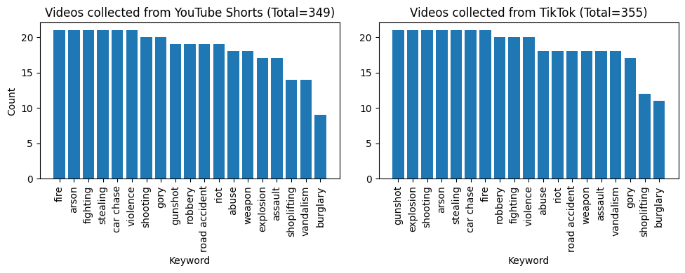
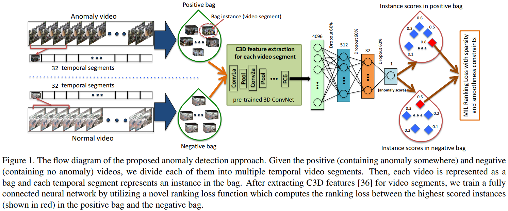
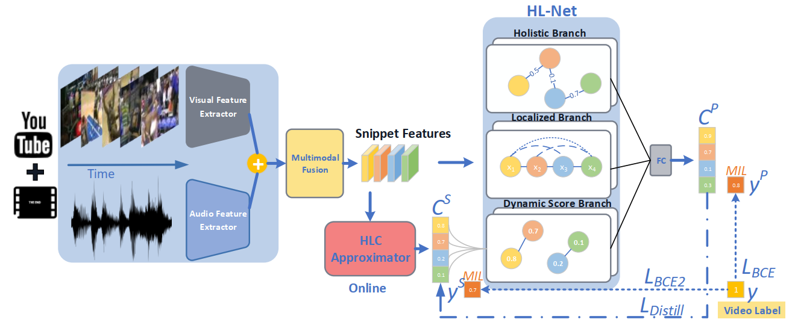
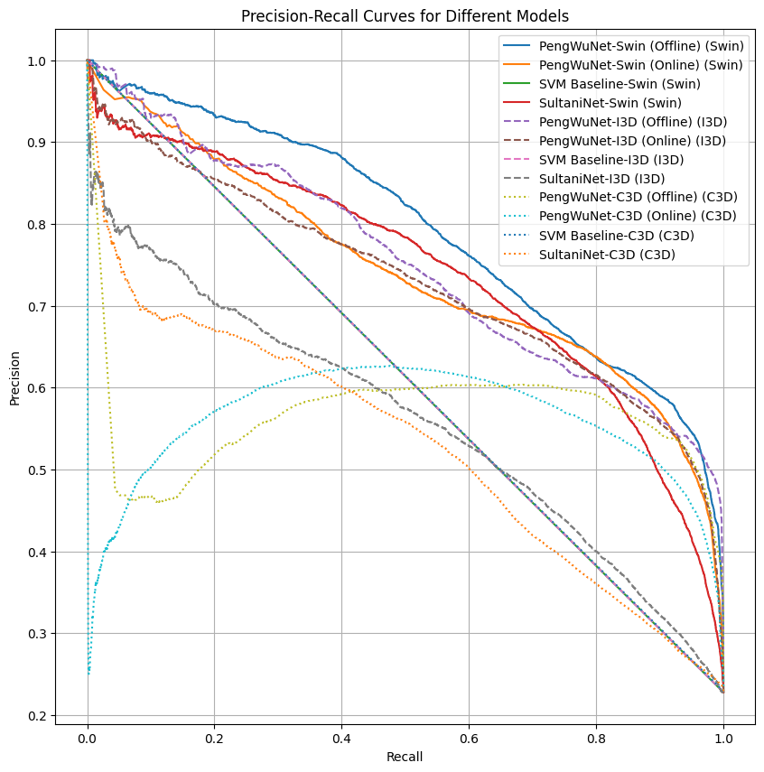
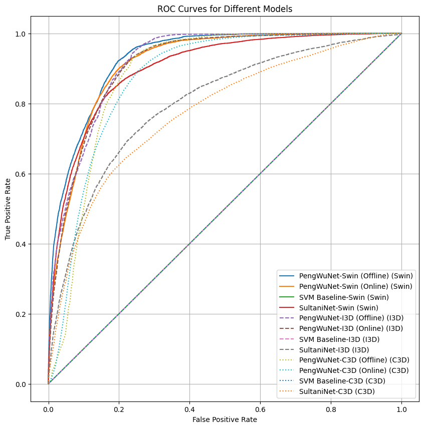

# Project Update: Inapproriate Content Identification in Social Media

**Author:** Hong Jia Herng  
**Code:** [GitHub Repository](https://github.com/hongjiaherng/inappropriate-video-detection)

## 1. Dataset Collection & Preparation

This project utilized 2 datasets:

- XD-Violence Dataset:

  - Served as the primary training dataset for the violence detection model in this project. Contains 4754 untrimmed videos (~217 hours).
  - The training set includes video-level labels (anomalous/normal), while the test set includes frame-level labels, indicating the frame number of violent events.
  - I hosted the [full dataset on HuggingFace Hub](https://huggingface.co/datasets/jherng/xd-violence/tree/main) for easier training and testing.

- My own Shorts dataset:
  - Consists of 704 short videos (< 1 min) searched using the keywords below with 7 different languages (i.e., English, Spanish, Portuguese, Hindi, Korean, Chinese, and Malay).
  - Search keywords (19): `Abuse`, `Explosion`, `Fighting`, `Riot`, `Shooting`, `Arson`, `Assault`, `Road accident`, `Burglary`, `Robbery`, `Stealing`, `Shoplifting`, `Vandalism`, `Fire`, `Weapon`, `Car chase`, `Gunshot`, `Gory scene`, `Violence`
  - Never got enough time to label the dataset, this dataset is only used for analysis with the trained anomaly detection model.
    

## 2. Feature Extraction

Implemented video preprocessing pipeline and piped in 3 popular pretrained backbone models to extract features from the videos. Pretrained models are obtained from [MMAction2](https://mmaction2.readthedocs.io/en/latest/model_zoo/recognition.html). The 3 models are:

- C3D
- I3D
- Video Swin Transformer (Tiny)

These models extract spatial-temporal features from the video clips, providing a robust representation for anomaly detection. The extracted features are then saved along with the [hosted dataset on HuggingFace Hub](https://huggingface.co/datasets/jherng/xd-violence/tree/main/data) to facilitate subsequent training and testing.

## 3. Anomaly Detection Model

A video anomaly detection model is designed to identify anomalous frames/snippets within non-fixed length videos. Weakly-supervised training approach: These models while being trained on video-level labels, are able to predict frame-level labels at inference time.

Implemented weakly-supervised anomaly detection models:

- SVM Baseline:

  - A simple MLP model trained with SVM/hinge loss serving as a baseline for comparative analysis.

- Deep MIL Ranking Model (SultaniNet):

  - Utilizes a Multiple Instance learning (MIL) ranking loss during training. A MIL ranking loss is a modified hinge loss that selects the average of the top-k scores as the video-level score to train the model with video-level ground truth label.
  - Referenced from [Sultani et al., 2018](https://paperswithcode.com/paper/real-world-anomaly-detection-in-surveillance).
    

- HL-Net (PengWuNet):

  - A model that consists of 3 parallel branches to capture various relations among video snippets using graph convolutional layers. The holistic branch captures long-range dependencies, the localized branch captures local positional relations, and the score branch captures the closeness of predicted score of each snippet. This requires the whole input video sequence to be fed into the model (Offline).
  - It also has a online variant model that only requires a sliding window of the input video sequence to be fed into the model (Online).
  - Referenced from [Peng et al., 2020](https://paperswithcode.com/paper/not-only-look-but-also-listen-learning).
    
    _Note: Audio features are not used in this project._

All models were trained using video-level labels (weak labels) on the training set and evaluated using frame-level labels (strong labels) on the XD-Violence test set.

### Results

All models are trained with 50 epochs and checkpoint with the best validation AP is saved. Results of anomaly detection models using different pretrained backbone models on the XD-Violence test set. Bolded results indicate the best performing model.

| Model                    | Feature  | Average Precision (AP) | ROC-AUC    | Best Epoch | Configuration                                                                                                                                  |
| ------------------------ | -------- | ---------------------- | ---------- | ---------- | ---------------------------------------------------------------------------------------------------------------------------------------------- |
| SVM Baseline             | C3D      | 0.6146                 | 0.5        | 18         | [link](https://github.com/hongjiaherng/inappropriate-video-detection/blob/main/anomaly-detection/configs/svm_baseline/baseline-c3d.yaml)       |
| SultaniNet               | C3D      | 0.53                   | 0.7751     | 40         | [link](https://github.com/hongjiaherng/inappropriate-video-detection/blob/main/anomaly-detection/configs/sultani_net/sultaninet-c3d.yaml)      |
| PengWuNet (Offline)      | C3D      | 0.5555                 | 0.8829     | 14         | [link](https://github.com/hongjiaherng/inappropriate-video-detection/blob/main/anomaly-detection/configs/pengwu_net/hlnet-ctx_len_5-c3d.yaml)  |
| PengWuNet (Online)       | C3D      | 0.5561                 | 0.8747     | 14         | [link](https://github.com/hongjiaherng/inappropriate-video-detection/blob/main/anomaly-detection/configs/pengwu_net/hlnet-ctx_len_5-c3d.yaml)  |
| SVM Baseline             | I3D      | 0.6140                 | 0.5        | 50         | [link](https://github.com/hongjiaherng/inappropriate-video-detection/blob/main/anomaly-detection/configs/svm_baseline/baseline-i3d.yaml)       |
| SultaniNet               | I3D      | 0.5604                 | 0.8004     | 6          | [link](https://github.com/hongjiaherng/inappropriate-video-detection/blob/main/anomaly-detection/configs/sultani_net/sultaninet-i3d.yaml)      |
| PengWuNet (Offline)      | I3D      | 0.7508                 | 0.9197     | 38         | [link](https://github.com/hongjiaherng/inappropriate-video-detection/blob/main/anomaly-detection/configs/pengwu_net/hlnet-ctx_len_5-i3d.yaml)  |
| PengWuNet (Online)       | I3D      | 0.7303                 | 0.9132     | 38         | [link](https://github.com/hongjiaherng/inappropriate-video-detection/blob/main/anomaly-detection/configs/pengwu_net/hlnet-ctx_len_5-i3d.yaml)  |
| SVM Baseline             | Swin     | 0.6140                 | 0.5        | 50         | [link](https://github.com/hongjiaherng/inappropriate-video-detection/blob/main/anomaly-detection/configs/svm_baseline/baseline-swin.yaml)      |
| SultaniNet               | Swin     | 0.7407                 | 0.903      | 12         | [link](https://github.com/hongjiaherng/inappropriate-video-detection/blob/main/anomaly-detection/configs/sultani_net/sultaninet-swin.yaml)     |
| **PengWu-Net (Offline)** | **Swin** | **0.7918**             | **0.9304** | 4          | [link](https://github.com/hongjiaherng/inappropriate-video-detection/blob/main/anomaly-detection/configs/pengwu_net/hlnet-ctx_len_5-swin.yaml) |
| PengWuNet (Online)       | Swin     | 0.742                  | 0.9156     | 4          | [link](https://github.com/hongjiaherng/inappropriate-video-detection/blob/main/anomaly-detection/configs/pengwu_net/hlnet-ctx_len_5-swin.yaml) |

#### Precision-Recall (PR) Curves

#### ROC Curves

