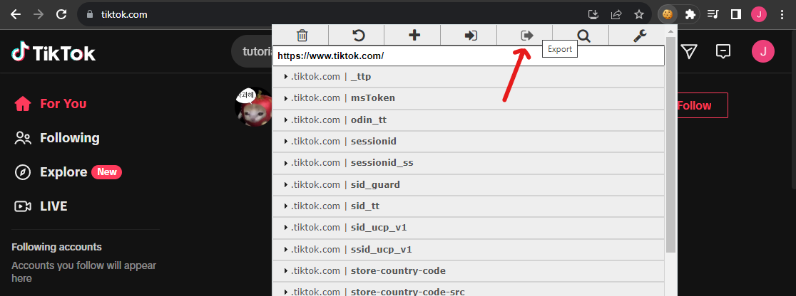
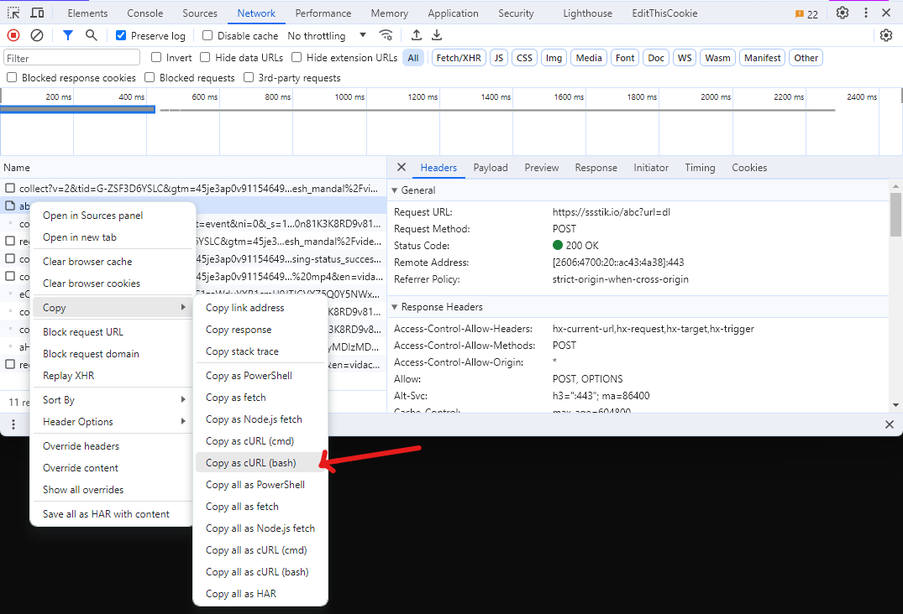

# data-scraper

A script to scrape and download YouTube Shorts and TikTok videos. Focusing on short videos that contain violent elements to build a dataset for inappropriate content classification in short social media videos.

## Table of Contents

- [Pre-requisites](#pre-requisites)
  - [Python Environment](#python-environment)
  - [YouTube Data API v3](#youtube-data-api-v3)
  - [Cookies for Unofficial TikTok API](#cookies-for-unofficial-tiktok-api)
  - [SSSTIK Request Parameters](#ssstik-request-parameters)
- [Usage](#usage)
- [Data Collection Methology](#data-collection-methology)
  - [1. Identify the targeted types of violence / inappropriateness](#1-identify-the-targeted-types-of-violence--inappropriateness)
  - [2. Search with multiple languages for broader coverage](#2-search-with-multiple-languages-for-broader-coverage)
  - [3. Start scraping](#3-start-scraping)
    - [3.1 YouTube Shorts](#31-youtube-shorts)
    - [3.2 TikTok](#32-tiktok)
  - [4. Data labelling](#4-data-labelling)

## Pre-requisites

### Python Environment

```bash
# Make sure you are in the root directory of this subrepository
cd data-scraper

# Install dependencies using poetry
poetry install --no-root

# Activate the virtual environment
poetry shell

# Install playwright browsers (required for TikTokAPI)
python -m playwright install
```

### YouTube Data API v3

1. Go to [Google Cloud Console](https://console.cloud.google.com/).
2. Create a new project.
3. Enable YouTube Data API v3.
4. Create an API key and copy it.
5. Create a `.env` file at the project root then paste the API key in the file as follows:

```
YOUTUBE_DATA_API_KEY_1=<YOUR_API_KEY>
```

6. If you create more than one API key (due to rate limit reason), add them to the `.env` file as follows:

```
YOUTUBE_DATA_API_KEY_1=<YOUR_API_KEY>
YOUTUBE_DATA_API_KEY_2=<YOUR_NEW_API_KEY>
```

### Cookies for Unofficial TikTok API

1. Get this [Chrome extension](https://chrome.google.com/webstore/detail/editthiscookie/fngmhnnpilhplaeedifhccceomclgfbg/related) for exporting cookies.
2. Go to [TikTok](https://www.tiktok.com/) and login to your account.
3. Click on the extension icon and export the cookies by copying to your clipboard.
   
4. Create a `cookies.json` file at the project root and paste the copied content into the file.

Find additional details in [this issue](https://github.com/davidteather/TikTok-Api/issues/1012#issuecomment-1607264627).

### SSSTIK Request Parameters

1. Go to [SSSTIK](https://ssstik.io/en).
2. Open the developer tools and go to the Network tab.
3. Paste any TikTok video URL and click on "Download".
4. Find the log with the name `abc?url=dl` and right-click on it. Then, click Copy > Copy as cURL (bash).
   
5. Paste the copied content into [curlconverter](https://curlconverter.com/) and pick JSON as the output format.
6. Create a `ssstik_params.json` file at the project root and paste the copied JSON into the file.

## Usage

1. Make sure you activate the virtual environment.

```bash
poetry shell
```

2. Generate all keywords in different languages for scraping

```bash
python src/main.py --task generate_keywords
```

3. Scrape and download videos from YouTube Shorts and TikTok (re-run the command if it fails)

```bash
python src/main.py --task scrape_youtube
python src/main.py --task scrape_tiktok
```

## Data Collection Methology

### 1. Identify the targeted types of violence / inappropriateness

We attempt to collect videos that contain the following types of violence / inappropriateness (19 keywords):

- Abuse
- Explosion
- Fighting
- Riot
- Shooting
- Arson
- Assault
- Road accident
- Burglary
- Robbery
- Stealing
- Shoplifting
- Vandalism
- Fire
- Weapon
- Car chase
- Gunshot
- Gory scene
- Violence

The list above is curated from the combination of different violent elements from 3 prominent violence-related datasets.

| Dataset                                                              | Types of violence                                                                                                                |
| -------------------------------------------------------------------- | -------------------------------------------------------------------------------------------------------------------------------- |
| [XD-Violence](https://roc-ng.github.io/XD-Violence/)                 | Abuse, Car accident, Explosion, Fighting, Riot, Shooting                                                                         |
| [UCF-Crime](https://www.crcv.ucf.edu/projects/real-world/)           | Abuse, Arrest, Arson, Assault, Road Accident, Burglary, Explosion, Fighting, Robbery, Shooting, Stealing, Shoplifting, Vandalism |
| [VSD](https://www.interdigital.com/data_sets/violent-scenes-dataset) | Fighting, Fire, Weapon, Car chase, Gunshot, Explosion, Gory scene, Scream                                                        |

### 2. Search with multiple languages for broader coverage

[Top 5 most popular languages](https://www.twinword.com/blog/features-of-top-250-youtube-channels/) of 250 leading YouTube channels. In order to get more local Malaysian data, includes Chinese and Malay.

- English
- Spanish
- Portuguese
- Hindi
- Korean
- Chinese
- Malay

### 3. Start scraping

Perform the search in both Youtube Shorts and Tiktok.

1. For each violent keyword, search in each language.
2. Retrieve up to top 3 results from each search (3 results x 7 languages x 19 keywords x 2 platforms = ~798 videos).

#### 3.1 YouTube Shorts

1. Use [YouTube Data API v3](https://developers.google.com/youtube/v3) to search for videos using query, e.g., "#shorts fighting".
2. Retrieve the top 3 results from search.
3. Filter out the videos that are not from YouTube Shorts.
4. Use [yt-dlp](https://github.com/yt-dlp/yt-dlp) to download the videos.

#### 3.2 TikTok

1. Use unofficial [TikTok API](https://github.com/davidteather/TikTok-Api) to search for videos using query, e.g., "fighting".
2. Retrieve the top 3 results from search.
3. Filter out the videos that are longer than 60 s (we want to focus on short videos).
4. Use [SSSTIK](https://ssstik.io/en) to download the videos.

### 4. Data labelling

- Label the videos as "appropriate" or "inappropriate" based on the violent elements in the videos.
- Potential tool: https://labelbox.com/product/annotate/video/